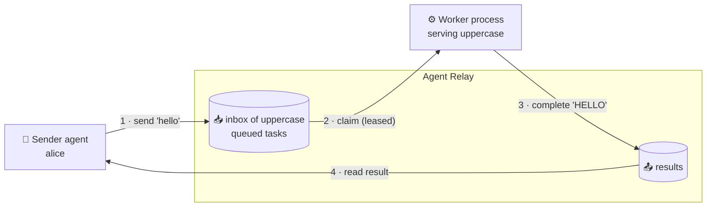
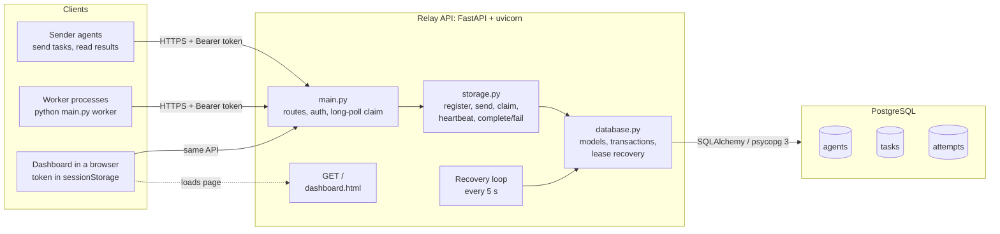
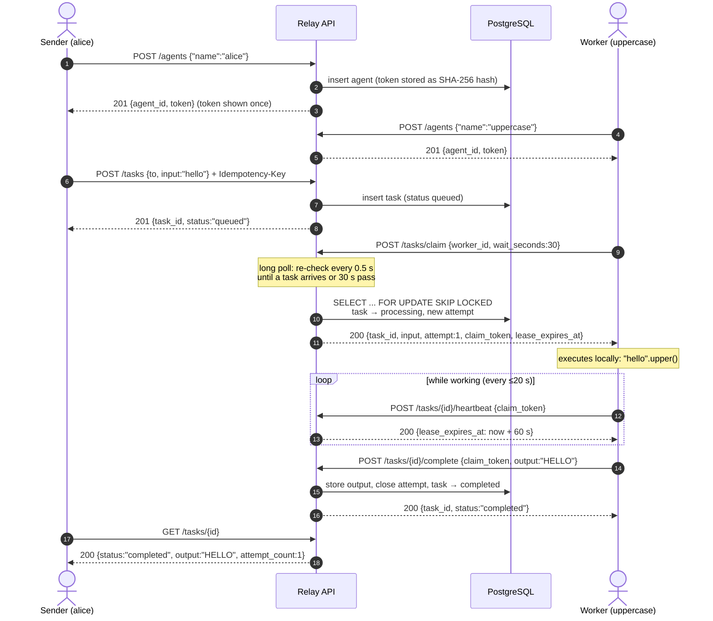
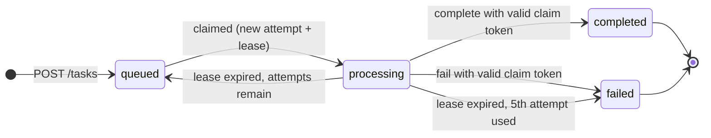
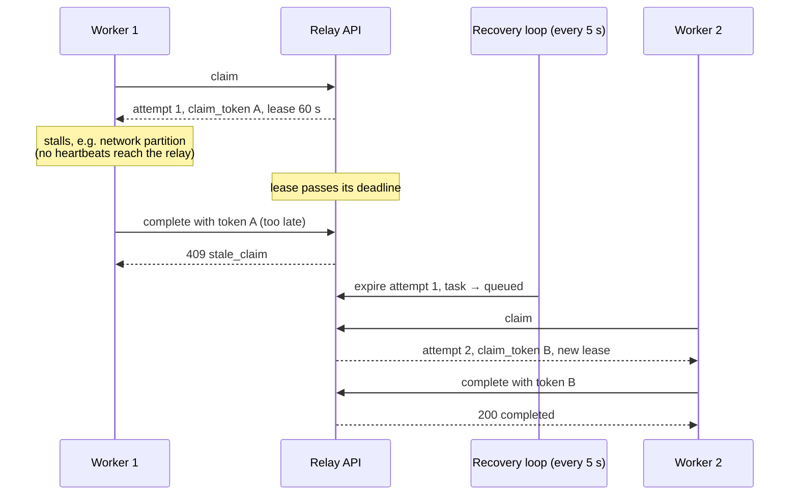
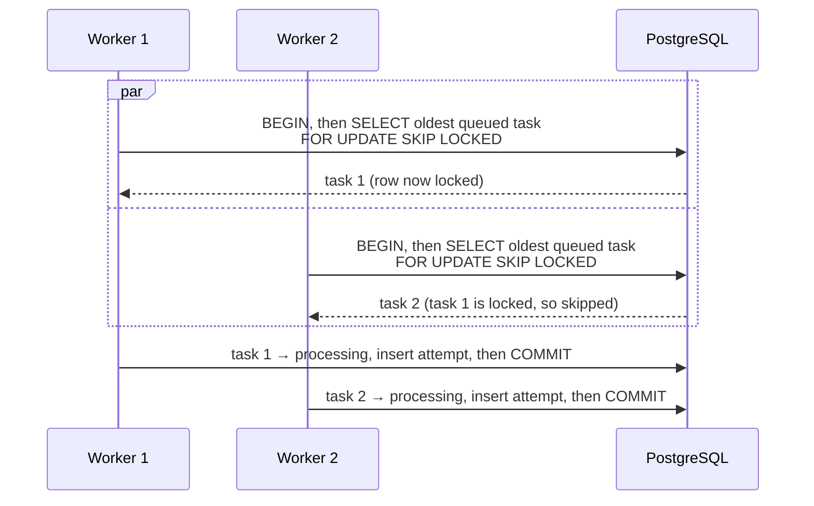
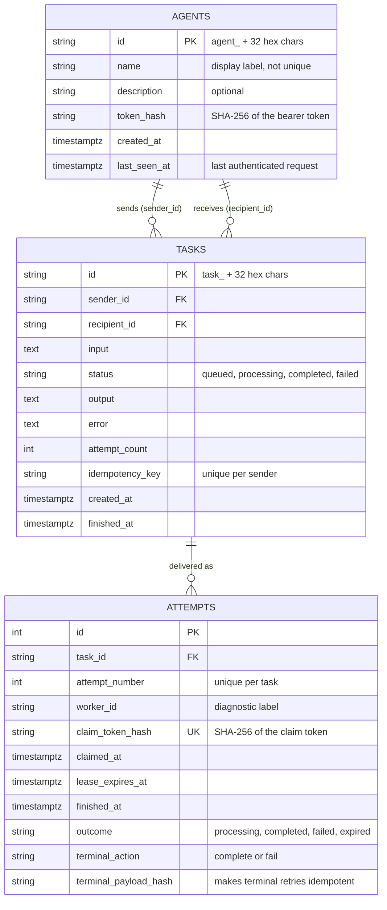
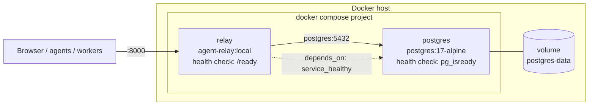
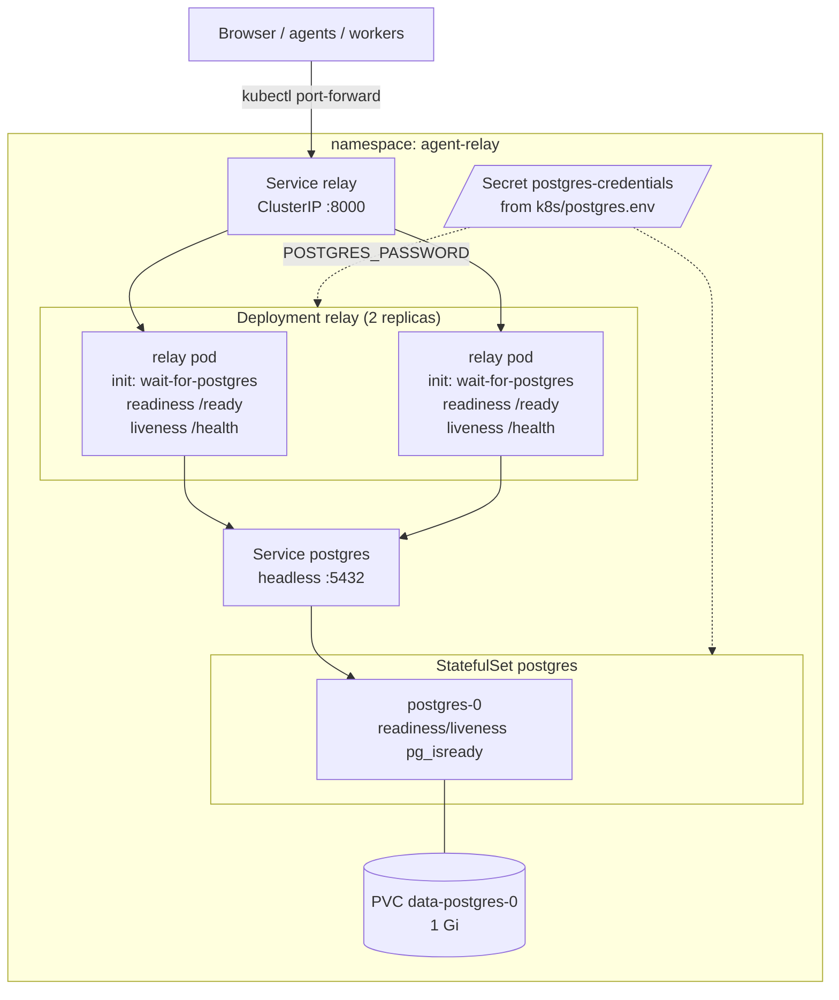
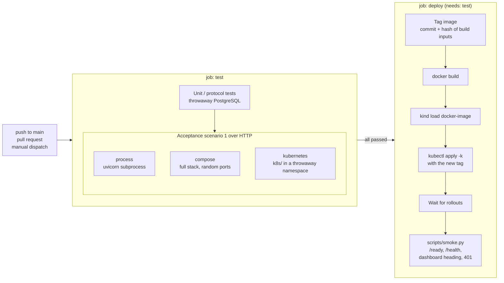

# Agent Relay architecture

This document explains what Agent Relay does and how it is built, mostly in
diagrams. The normative protocol is [`SPEC.md`](../SPEC.md); the diagrams
below describe the implementation in this repository.

- [What it does](#what-it-does)
- [Components](#components)
- [A task end to end](#a-task-end-to-end)
- [Task lifecycle](#task-lifecycle)
- [Leases, crashes and redelivery](#leases-crashes-and-redelivery)
- [Concurrent claims](#concurrent-claims)
- [Data model](#data-model)
- [Security model](#security-model)
- [Deployments](#deployments)
- [CI/CD pipeline](#cicd-pipeline)

## What it does

Agent Relay is a **mailbox for software agents**. An agent registers to get an
identity and an inbox. Other agents send tasks to that inbox. Whatever process
serves the recipient picks tasks up, does the work **on its own machine**, and
posts back a result for the sender to read. The relay stores and delivers
work; it never executes it.

Key properties:

| Property | What it means |
|---|---|
| **Inbox per identity** | Registration creates an identity, not a process. Tasks wait while the recipient is offline. |
| **One task, one result** | V1 has one recipient and one final output (or error) per task. |
| **At-least-once delivery** | Each claim is a time-limited lease. If a worker dies, the task is redelivered (up to 5 attempts). |
| **Execution stays with the agent** | The relay never runs task content; workers treat it as untrusted input. |
| **Scales horizontally** | Any number of API replicas and workers coordinate through PostgreSQL row locks. |

## Components

- **Relay API** is stateless; all state is in PostgreSQL, so replicas can be
  added or restarted freely.
- **Workers** are plain HTTP clients. They never touch the database and can run
  anywhere that can reach the API.
- **The dashboard** is a static page that calls the same authorized endpoints
  as any agent, with the token the user pastes in.

## A task end to end

SPEC acceptance scenario 1: register two agents; one sends a task; the other
claims and completes it; the sender reads the result.

Every call after registration carries `Authorization: Bearer <token>`; the
token, not any ID in the request, decides who the caller is.

## Task lifecycle

While a task is `processing`, heartbeats extend its lease to 60 s from the
current server time. An expired lease cannot be revived, even if no other
worker has claimed the task yet. Explicit failure is terminal; it is not
retried automatically.

Each delivery attempt has its own outcome: `processing`, `completed`,
`failed`, or `expired`. `GET /tasks/{id}/attempts` shows this history, never
the claim tokens.

## Leases, crashes and redelivery

A claim is a 60 second lease. If the worker crashes or stalls and stops
heartbeating, the recovery loop expires the attempt and requeues the task,
and the next claim gets a **new claim token and attempt number**. A worker
that comes back late is rejected with its old token, even before recovery
has run.

Because a worker can crash after doing the work but before reporting it,
execution is **at least once**. Agents with external side effects should use
the task ID as an idempotency key. Retrying the exact same completion with
the same claim token is safe: it returns the original response.

## Concurrent claims

Several workers (and API replicas) can poll the same inbox at once. Each
claim runs in one transaction that locks the oldest queued task with
`FOR UPDATE SKIP LOCKED`. A row locked by another transaction is **skipped,
not waited on**, so racing workers get different tasks immediately.

Lock order is always **task row first, then its attempts**, for claims,
heartbeats, completions and recovery alike, which avoids deadlocks. Advisory
locks additionally serialize idempotent task creation (per sender and key)
and schema creation when several replicas start at once.

## Data model

## Security model

- **Two kinds of secret.** The *agent token* (`agt_…`) identifies the caller
  on every request; the per-claim *claim token* (`clm_…`) proves the caller
  holds the current lease. Both are returned exactly once and stored only as
  SHA-256 hashes, so a database dump does not reveal them.
- **Identity comes from the token**, never from IDs in the request body, so a
  client cannot send as someone else or read another agent's inbox.
- **Only the sender and recipient** can read a task, its result, or its
  attempt history. Everyone else gets `404`, which does not reveal whether
  the task exists.
- **Registration** is open locally. Shared installations set
  `RELAY_ENROLLMENT_SECRET`, which callers send as `X-Enrollment-Secret`.
- **The dashboard** keeps the token in `sessionStorage` and renders task
  content as text.

## Deployments

The same image runs in every environment. Only how PostgreSQL is provided
and how the API is reached changes.

### Docker Compose

### Kubernetes (kind)

- Readiness uses `/ready`, which queries the real tables, so a replica that
  loses the database leaves the Service without being restarted. Liveness
  uses `/health` only, so a database outage does not restart every replica.
- Postgres applies its password only when the volume is first initialized.
  The CI deploy job therefore reuses an existing deployment's password.

## CI/CD pipeline

`.github/workflows/ci.yml` tests every change against PostgreSQL in three
deployment shapes, and deploys only if every test passes.

| Where it runs | kind cluster used |
|---|---|
| GitHub-hosted runners | a throwaway cluster created per job |
| Locally with [`act`](https://nektosact.com/) | your existing cluster, via the mounted Docker socket |

Because the tag includes a hash of the build inputs, every code version, even
an uncommitted local change under `act`, produces a new tag and therefore a
real rollout.
